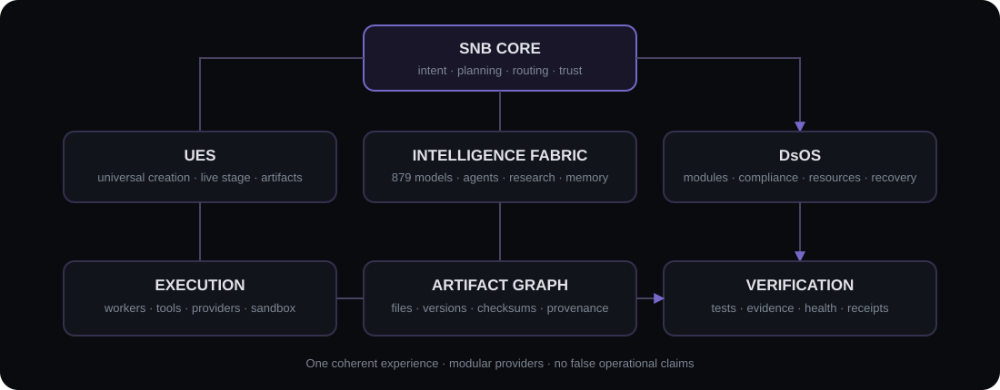

<p align="center">
  
</p>

<p align="center"><strong>Composed intelligence. Verified execution. Universal creation.</strong></p>

<p align="center">
  <a href="#quick-start"><strong>Run the App</strong></a> ·
  <a href="docs/FINAL-V1-READINESS.md"><strong>V1 Readiness</strong></a> ·
  <a href="docs/V1-REMAINING-GAPS.md"><strong>Remaining Gaps</strong></a> ·
  <a href="SECURITY.md"><strong>Security</strong></a> ·
  <a href="LICENSE"><strong>Apache-2.0</strong></a>
</p>

---

## What is SNB?

**Singularity Neural Bunker (SNB)** is an open-source composed-intelligence platform by Bunker Studios. It coordinates models, agents, research, memory, tools, workers, artifacts, verification and recovery as one coherent system.

SNB is not a single model and does not claim consciousness. Its objective is practical, measurable capability:

```text
Intent → Plan → Specialists → Tools → Execution → Verification → Artifact → Delivery
```

Two major modules live inside SNB:

- **Universal Engine of the Singularity (UES)** — remote-first, AI-native universal creation studio with a real artifact stage, command chat, runtime patching and provider-neutral production pipelines.
- **Divine Singularity OS (DsOS)** — modular systems-engineering environment for Divine Core/Droid/Linux/compatibility projects. It does not claim a bootable image until a real toolchain builds and tests one.

<p align="center"></p>

## Verified V1 Beta capabilities

### Intelligence and orchestration

- Canonical registry of **879 exact Puter models** from 17 providers—no invented IDs
- Real browser-side Puter Beta chat with exact-model validation and bounded fallback
- Parallel multi-model web Research Swarm with evidence/contradiction tracking
- Provider-neutral model routing, benchmark campaigns, health metrics and circuit breakers
- Universal Problem Solver and persistent mission DAGs
- Workers with atomic claims, leases, heartbeat, retries and crash-boundary idempotency

### Execution, trust and data

- SQLite WAL persistence, migrations, tenant isolation and online backup verification
- JWT access tokens, rotating refresh tokens, one-time password recovery and audit
- Tool Registry, Policy Engine, one-time approvals and deterministic verifiers
- Validation-only JavaScript/TypeScript/JSON sandbox; arbitrary untrusted execution remains gated on container/microVM infrastructure
- Artifact Graph with versions, dependencies, provenance, licenses, checksums and verification
- External job-provider adapter: health → submit → poll → download → checksum → artifact → receipt
- Tool Factory that generates, typechecks, tests and registers reusable tool packages as `testing`
- Release Packager producing verified `.tar.gz` bundles with manifest, README, changelog and checksums

### Universal Engine of the Singularity

- Lightweight lazy-loaded Studio: real stage + command chat + authenticated attachments
- Exactly **220 typed settings** across 22 categories and **10 presets**
- Native runtime patching without Java/reload for active settings
- Real lightweight pipeline: GLB → UV/normals → six PBR PNG maps → material → scene → offline WebGL build
- Experimental mathematical 4D runtime: 16-vertex/32-edge tesseract, XW/YW rotation and 4D→3D→2D projection
- Real project/artifact state—no fake construction progress

### Divine Singularity OS

- Persistent Core/Droid/Linux/Win-compatibility project contracts
- Base/license/checksum analysis, module graph, cycle detection and host permission blocking
- Resource Profile Compiler for low-end devices and remote-build policy
- Real `divine-os-project.json` artifact; boot remains an explicit infrastructure gap

## Honest capability states

SNB separates implementation state instead of treating UI as functionality:

| State | Meaning |
|---|---|
| `operational` / `verified` | Executed with observable result and tests/verifier |
| `partial` | Real subset works; documented scope remains |
| `adapter-required` | Internal contract is ready; provider adapter is not connected |
| `infrastructure-required` | Needs external runtime, hardware, domain, browser or toolchain |
| `blocked` | Policy, safety, license or dependency prevents execution |
| `planned` | Registered requirement; not represented as working |

See the generated [Final V1 Readiness Report](docs/FINAL-V1-READINESS.md) and [Remaining Gaps](docs/V1-REMAINING-GAPS.md).

## Lightweight by architecture

The client is a terminal, not a workstation replacement. Heavy jobs belong to workers/providers. Major workspaces are code-split and loaded only when opened.

Typical production build from the current Beta:

```text
Main JS gzip          ~80 KB
UES lazy chunk gzip    ~4 KB
DsOS lazy chunk gzip   ~3 KB
```

Low-end devices receive reduced control pagination, thumbnails/progressive previews and no bundled 3D engine or local large model.

## Quick start

### Requirements

- Node.js 20+ (tested on Node.js 22)
- npm
- Optional Puter account for User-Pays model execution

```bash
git clone https://github.com/devEb209/-Singularity-AI-.git
cd -- ./-Singularity-AI-
npm install
npm run secrets:generate
```

Run three processes:

```bash
npm run dev:api       # API — 0.0.0.0:8787
npm run start:worker  # safe local tool worker
npm run dev           # web app — 0.0.0.0:5173
```

> The clone command creates the repository directory automatically. If your shell does not accept the `cd` example because of the leading dash, use `cd -- ./-Singularity-AI-`.

### Verification

```bash
npm run beta:check    # lint + tests + TS frontend/backend + build + prod audit
npm run v1:report     # regenerate readiness report
npm run backup:create
npm run backup:verify -- <backup-directory>
```

Playwright specs are included:

```bash
npm run e2e:install
npm run e2e
```

Chromium installation requires access to Playwright's CDN; this sandbox previously returned `ECONNRESET`, so E2E is not falsely counted as passed here.

## External providers

Copy [`docs/providers.example.json`](docs/providers.example.json) to the ignored configured path and reference credentials by environment-variable name—never place tokens in the JSON or frontend.

```env
EXTERNAL_PROVIDER_CONFIG=./data/providers.json
MY_3D_PROVIDER_TOKEN=secret
```

A configured provider must implement the documented job protocol. See [External Provider Adapter](docs/EXTERNAL-PROVIDER-ADAPTER.md).

## Repository map

```text
src/                 React client and lazy UES/DsOS workspaces
server/              API, domain, repositories, services and worker
scripts/             model import, backup, secret and report tooling
tests/e2e/           Playwright Beta flows
docs/                architecture, readiness, legal and operational docs
assets/               SVG brand and architecture assets
puter-models.txt      canonical Puter snapshot supplied by project owner
```

## Documentation

- [Backend](docs/BACKEND.md)
- [SNB Master Intelligence and 30 cognitive programs](docs/SNB-MASTER-INTELLIGENCE.md)
- [Versioned Knowledge Memory](docs/KNOWLEDGE-MEMORY.md)
- [Universal Document Engine](docs/UNIVERSAL-DOCUMENT-ENGINE.md)
- [Automation Engine](docs/AUTOMATION-ENGINE.md)
- [Plugin Package Runtime](docs/PLUGIN-RUNTIME.md)
- [Puter and model policy](docs/PUTER.md)
- [Research Swarm](docs/RESEARCH-SWARM.md)
- [Capability Fabric](docs/CAPABILITY-FABRIC.md)
- [UES / Divine Engine](docs/DIVINE-ENGINE.md)
- [UES Core Runtime](docs/UES-CORE-RUNTIME.md)
- [UES Advanced Internal Pipeline](docs/UES-ADVANCED-PIPELINE.md)
- [HSDS lightweight interactive streaming](docs/HSDS.md)
- [Divine OS](docs/DIVINE-OS.md)
- [Experimental 4D](docs/EXPERIMENTAL-4D.md)
- [Workers and model health](docs/WORKERS-AND-HEALTH.md)
- [Security and external gates](docs/CRITICAL-BETA-GATES.md)
- [Commercial and legal notes](docs/COMMERCIAL-AND-LEGAL.md)

## Security

Read [SECURITY.md](SECURITY.md). Never commit `.env`, database files, uploads, provider credentials or generated backups. Physical execution is disabled and requires a separate certified safety architecture.

## License and commercial use

SNB source code is licensed under the [Apache License 2.0](LICENSE), including commercial use subject to its terms. The license does not grant rights to third-party models/services or project trademarks. See [NOTICE](NOTICE), [Third-Party Notices](THIRD_PARTY_NOTICES.md) and [Commercial & Legal Notes](docs/COMMERCIAL-AND-LEGAL.md).

## Contributing

Read [CONTRIBUTING.md](CONTRIBUTING.md) and the [Code of Conduct](CODE_OF_CONDUCT.md). Contributions must preserve honest capability states and include verification for operational claims.

---

<p align="center"><strong>Bunker Studios</strong><br>One coherent intelligence. Many verified specialists.</p>
